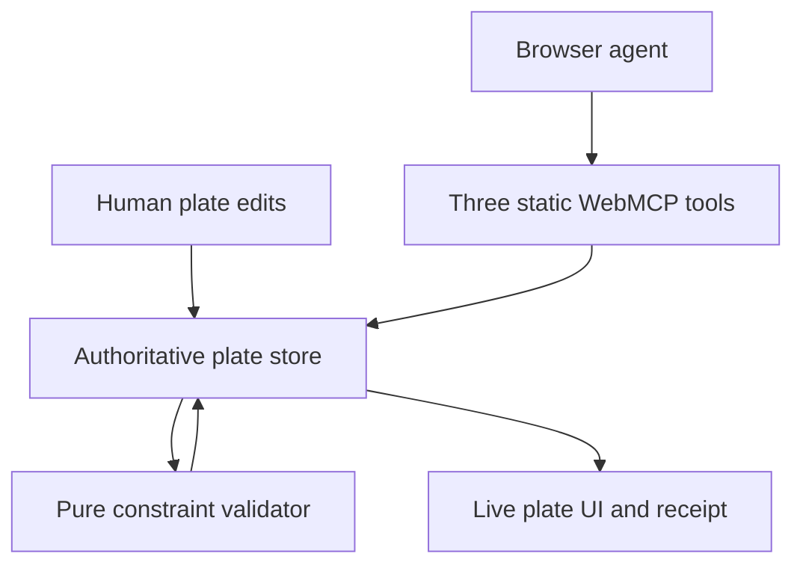

# Architecture

WellSet uses one state machine for both participants: the visual interface and the browser agent.

## Modules

- `src/domain.js` owns the plate vocabulary, deterministic layout and reflow, and validation.
- `src/store.js` owns the live state and subscriptions. Tool handlers read it at execution time, avoiding stale UI closures.
- `src/webmcp.js` performs guarded, singleton registration with `document.modelContext.registerTool()`.
- `src/app.js` renders the shared artifact and routes explicit human edits to the same store.

## Transaction boundary

Generation and reflow each perform mutation and validation as one synchronous transaction. A tool receipt includes revisions, movements, preserved locks, and the resulting validation status. Validation is intentionally not a separate tool call.

## Progressive enhancement

Without WebMCP, WellSet remains fully usable through its visible controls. In a compatible browser, the page registers semantic operations alongside that interface. ChatGPT Site Tools currently supports top-level imperative tools but not declarative tools or iframe registrations, so the critical path uses only the supported intersection.

## Deliberate constraints

The current deterministic compaction algorithm is a demonstrator, not a scientific optimizer. Production use would require protocol-specific constraints, liquid-handler compatibility, domain validation, audit persistence, access control, and formal verification against laboratory procedures.
